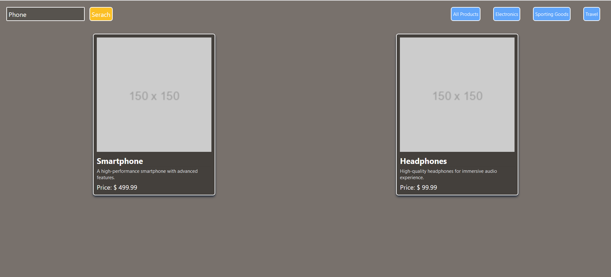
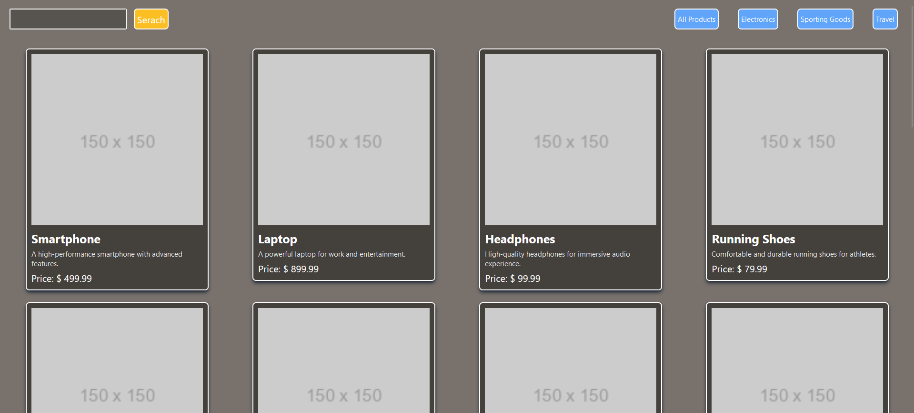
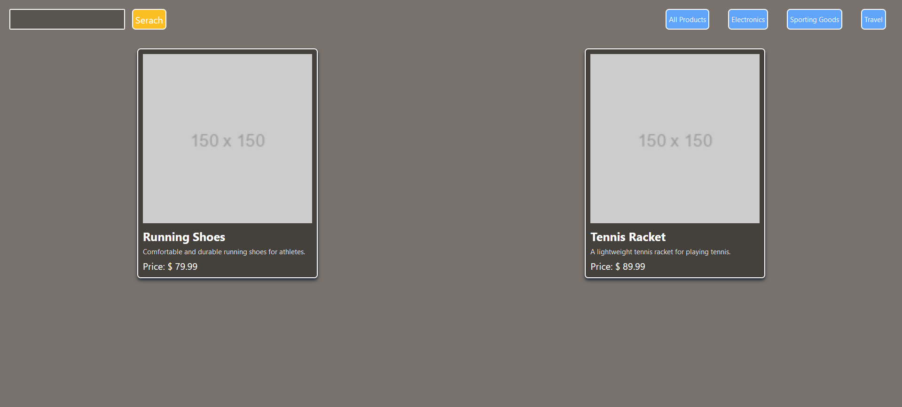

# FilterProducts-ReactJS

This is a simple product search application built with ReactJS, Vite, and Tailwind CSS. It allows users to search for products by name and filter them by category.

## Features

- Search products by name
- Filter products by category
- Display product details including name, description, and price

## Screenshots





## Technologies Used

- ReactJS
- Vite
- Tailwind CSS

## Getting Started

To run this project locally, follow these steps:

1. Clone the repository:

   ```bash
   git clone https://github.com/your-username/product-search-app.git
   ```

2. Navigate to the project directory:

   ```bash
   cd product-search-app
   ```

3. Install dependencies:

   ```bash
   npm install
   ```

4. Start the development server:

   ```bash
   npm run dev
   ```

5. Open your browser and go to [http://localhost:5173](http://localhost:5173) to view the app.

## Contributing

Contributions are welcome! If you find any issues or have suggestions for improvement, please open an issue or submit a pull request.

